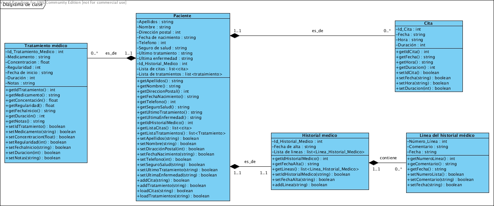

## **Clase pacientes**
Esta clase contendrá los datos de los pacientes que estén dados de alta en el sistema. En está clase se encuentran las posibles funciones trabajar con los pacientes.

**Datos**

Nombre | Tipo | Descripción
-- | :--: | :--
Apellidos | string | Este campo guarda los apellidos de un paciente. Este campo no puede estar vacío.
Nombre | string | Este campo guarda el nombre de un paciente. Este campo no puede estar vacío.
Dirección postal | int | Este campo guarda el código postar de un paciente.
Fecha de nacimiento | string | Este campo guarda la fehca de nacimiento de tal modo que quede dia/mes/año. Ejemplo: 02/07/1976.
Seguro de salud | string | Este campo guarda el tipo de seguro de salud que tiene el paciente. Unicamente puede ser "Publico" o "Privado".
Tratamiento actual | string | En este campo se guarda una breve descripción del tratamiento que está siguiendo actualmente.
Enfermedad actual | string | En este campo se guarda una breve descripción de la enfermedad actual que sufre.
**Métodos**

Función | Descripción
-- | :--
Buscar_Paciente() | Esta función pide al usuario el nombre y el apellido del paciente a buscar y llama a las funciones Buscar_Paciente_Apellidos(string) y Buscar_Paciente_Nombre(string). No es necesario que el usuario introduzca el nombre o el apellido para que se realice la busqueda. Devuelve todos los datos coincidentes con la busqueda.
Buscar_Paciente_Apellidos(string) | Esta función busca a un paciente por apellidos y devuelve todas las coincidencias que encuentra.
Buscar_Paciente_Nombre(string) | Esta función busca a un paciente por el nombre y devuelve todas las coincidencias que encuentra.

