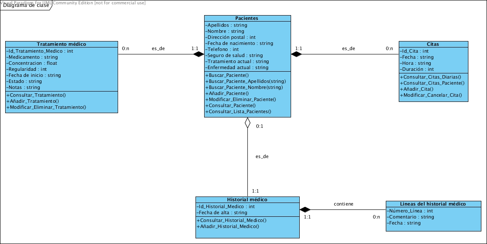

## **Clase pacientes**
Esta clase contendrá los datos de los pacientes que estén dados de alta en el sistema. En está clase se encuentran las posibles funciones trabajar con los pacientes. El identificador de la clase es el nombre del paciente más el apellido de este.

**Datos**

Nombre | Tipo | Descripción
-- | :--: | :--
Apellidos | string | Este campo guarda los apellidos de un paciente. Este campo no puede estar vacío.
Nombre | string | Este campo guarda el nombre de un paciente. Este campo no puede estar vacío.
Dirección postal | int | Este campo guarda el código postar de un paciente.
Fecha de nacimiento | string | Este campo guarda la fecha de nacimiento de tal modo que quede día/mes/año. Ejemplo: 02/07/1976.
Seguro de salud | string | Este campo guarda el tipo de seguro de salud que tiene el paciente. Unicamente puede ser "Publico" o "Privado".
Tratamiento actual | string | En este campo se guarda una breve descripción del tratamiento que está siguiendo actualmente.
Enfermedad actual | string | En este campo se guarda una breve descripción de la enfermedad actual que sufre.

**Métodos**

Función | Descripción
-- | :--
Buscar_Paciente() | Esta función pide al usuario el nombre y el apellido del paciente a buscar y llama a las funciones Buscar_Paciente_Apellidos(string) y Buscar_Paciente_Nombre(string). No es necesario que el usuario introduzca el nombre o el apellido para que se realice la búsqueda. Devuelve todos los datos coincidentes con la búsqueda.
Buscar_Paciente_Apellidos(string) | Esta función busca a un paciente por apellidos y devuelve todas las coincidencias que encuentra.
Buscar_Paciente_Nombre(string) | Esta función busca a un paciente por el nombre y devuelve todas las coincidencias que encuentra.
Añadir_Paciente() | Esta función añade un paciente pidiendo los datos necesarios al usuario. Si este paciente ya existe mostrará un mensaje de error, si no lo guarda en la base de datos. A su vez se crea un nuevo historial médico con la fecha actual del sistema aunque antes se comprueba si no existía ya uno para ese paciente.
Modificar_Eliminar_Paciente() | Esta función le permite elegir al usuario si desea modificar o borrar un paciente. En caso de que quiera modificar le aparecerán los datos del paciente para que pueda modificarlo y después de comprobar que los datos estén correctos se guardarán. En caso de que quiera eliminar un paciente se le preguntará si está seguro de que desea eliminarlo antes de borrar a paciente de la base de datos.
Consultar_Lista_Pacientes() | Esta función muestra una lista con todos los pacientes que hay en la base de datos.

## **Clase citas**
La clase citas almacena las citas de los pacientes que se encuentran en la base de datos. Un paciente puede tener varías citas. Si un paciente es eliminado las citas de estos pacientes también serán eliminadas. No pueden haber dos citas con la misma fecha y hora. En esta clase se encuentran incluidas las funciones que puede realizar el usuario respecto a las citas.

**Datos**

Nombre | Tipo | Descripción
-- | :--: | :--
Id_Cita | int | Este campo es el identificador de la clase citas. Como identificador este tiene que ser único para cada cita.
Fecha | string | Este campo guarda la fecha en la que va a llevarse a cabo la cita de tal modo que quede día/mes/año. Ejemplo: 12/03/2020. Este campo es obligatorio.
Hora | string | Este campo guarda la hora en digital en la que va a llevarse a cabo la cita. Ejemplo: 17:30. Este campo es obligatorio.
Duración | string | En este campo se guarda al final de la cita el tiempo que durará esta en minutos. Ejemplo: 10.

**Métodos**

Función | Descripción
-- | :--
Consultar_Citas_Diarias() | Esta función accede a la base de datos, busca todas las citas cuya fecha coincide con la fecha actual del sistema y las muestra al usuario.
Consultar_Citas_Paciente() | Esta función accede a la base de datos, busca todas las citas de un único paciente y las muestra al usuario.
Añadir_Cita() | Esta función le pide al usuario los datos de una cita, después se comprueba de que no haya otra cita en esa fecha y esa hora. En caso de que ya haya una cita se mostrará un mensaje de error, en caso contrario se guardará la cita. No se puede añadir una cita que sea anterior a la fecha del sistema.
Modificar_Cancelar_Cita() | Esta función le permite al usuario elegir si desea modificar o cancelar una cita. En caso de que desee modificar una cita le pedirá los datos necesarios para ello y después de comprobar que estén correctos se guardan. En caso de que se desee cancelar una cita se le preguntará al usuario si está seguro y si es que sí esta se eliminará de la base de datos. No se podrán modificar ni cancelar una cita cuya fecha sea anterior a la fecha del sistema.

## **Clase tratamiento médico**
Esta clase almacena los tratamientos que ha seguido o está siguiendo el paciente. Si el paciente es borrado de la base de datos los tratamientos de este también serán borrados. En esta clase se encuentran las funciones que permiten manejar los tratamientos médicos.

**Datos**

Nombre | Tipo | Descripción
-- | :--: | :--
Id_Tratamiento_Medico | int | Este campo es el identificador de la clase tratamiento médico. Como identificador este tiene que ser único para cada tratamiento.
Medicamento | string | Este campo almacena el nombre del medicamento o tratamiento que debe seguir el paciente. Este campo es obligatorio.
Concentración | float | Este campo almacena la dosis que debe de tomar.
Regularidad | int | Este campo almacena el número de veces que debe de tomar el medicamento al día.
Fecha de inicio | string | Este campo guarda la fecha de inicio del tratamiento de tal modo que quede día/mes/año. Ejemplo: 10/12/2019. Este dato es obligatorio.
Estado | string | Este campo almacena el estado en el que se encuentra el tratamiento. Solo puede ser "En curso" y "Finalizado". Este dato es obligatorio.
Notas | string | Este campo almacena un mensaje que puede poner el usuario con respecto al tratamiento a seguir.

**Métodos**

Función | Descripción
-- | :--
Consultar_Tratamiento() | Esta función accede a la base de datos y muestra los tratamientos de un paciente.
Añadir_Tratamiento() | Esta función pide al usuario los datos necesarios para crear un nuevo tratamiento.
Modificar_Eliminar_Tratamiento() | Esta función permite al usuario elegir entre modificar y eliminar un tratamiento médico. Si desea eliminar un tratamiento médico el sistema preguntará al usuario si está seguro que desea borrarlo antes de hacerlo. Si desea modificar un tratamiento médico se le pedirán los nuevos datos al usuario y después se guardarán en la base de datos.

## **Clase historial médico**
Esta clase guarda el historial médico de cada paciente. Es la única clase que no es borrada aunque el paciente si sea eliminado de la base de datos. Esta clase se crea automáticamente cuando se crea un paciente. En esta clase se encuentran las funciones que permiten manejar el historial médico.

**Datos**

Nombre | Tipo | Descripción
-- | :--: | :--
Id_Historial_Medico | int | Este campo es el identificador de la clase historial médico. Como identificador este tiene que ser único para historial médico.
Fecha de alta | string | Este campo guarda la fecha del sistema en el momento en el que el paciente se registró en la base de datos de tal modo que quede día/mes/año. Ejemplo: 24/09/2010.

**Métodos**

Función | Descripción
-- | :--
Consultar_Historial_Medico() | Esta función accede a la base de datos y muestra todas las lineas del historial médico de un paciente. En caso de que no tenga ninguna línea se muestra un mensaje.
Añadir_Historial_Medico() | Esta función le pide datos al usuario sobre la línea del historial médico que va a añadir, la fecha es la del sistema. Una vez estén todos los datos correctos se pedirá confirmación ya que es un cambio irreversible.

## **Clase líneas del historial médico**
Esta clase almacena las líneas de cada historial médico. El historial médico no puede ser borrado por lo que las líneas tampoco. No se pueden modificar una vez se crean.

**Datos**

Nombre | Tipo | Descripción
-- | :--: | :--
Número_Línea | int |  Este campo es el identificador de la clase líneas del historial médico. Como identificador este tiene que ser único para cada línea de cada historial médico.
Comentario | string | Este campo almacena un mensaje escrito por el usuario sobre la enfermedad, lesión o similares del paciente. Este campo es obligatorio.
Fecha | string | Este campo almacena la fecha del sistema en el momento en el que se escribe la línea de tal modo que quede día/mes/año. Ejemplo: 06/11/2019.

